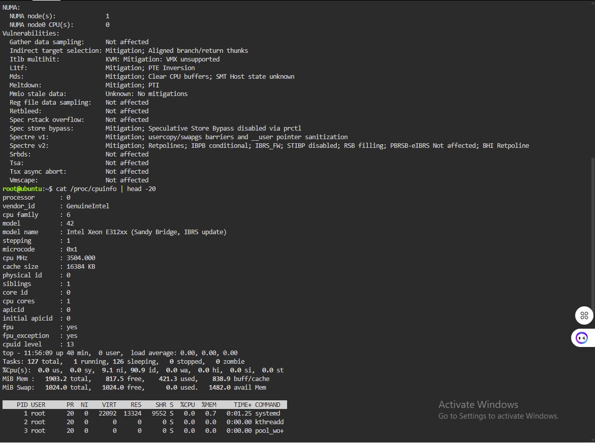

# Laboratory 03: Multi-Cloud Explorer

## Linux Server Investigation

### System Information Summary

| Component | Details |
|-----------|---------|
| **Operating System** | [e.g., Ubuntu 22.04.1 LTS] |
| **CPU** | [e.g., 2 vCPUs, Intel Xeon] |
| **Memory** | [e.g., 4GB RAM] |
| **Disk Space** | [e.g., 20GB available] |

### Cloud Hosting Options

If this Linux server were migrated to the cloud, the following services could host it:

#### AWS Options:
- **EC2 (Elastic Compute Cloud)** - Virtual machine service
- **Lightsail** - Simplified VPS service
- **ECS/EKS** - Container services

#### Azure Options:
- **Virtual Machines** - IaaS virtual machines
- **App Service** - PaaS web application hosting
- **AKS** - Kubernetes service

#### GCP Options:
- **Compute Engine** - Virtual machine service
- **App Engine** - PaaS application platform
- **GKE** - Kubernetes Engine

### Screenshots
# Laboratory 03: Multi-Cloud Explorer

## Linux Server Investigation

### System Information Summary

| Component | Details |
|-----------|---------|
| **Operating System** | [e.g., Ubuntu 22.04.1 LTS] |
| **CPU** | [e.g., 2 vCPUs, Intel Xeon] |
| **Memory** | [e.g., 4GB RAM] |
| **Disk Space** | [e.g., 20GB available] |

### Cloud Hosting Options

If this Linux server were migrated to the cloud, the following services could host it:

#### AWS Options:
- **EC2 (Elastic Compute Cloud)** - Virtual machine service
- **Lightsail** - Simplified VPS service
- **ECS/EKS** - Container services

#### Azure Options:
- **Virtual Machines** - IaaS virtual machines
- **App Service** - PaaS web application hosting
- **AKS** - Kubernetes service

#### GCP Options:
- **Compute Engine** - Virtual machine service
- **App Engine** - PaaS application platform
- **GKE** - Kubernetes Engine

### Screenshots

# Laboratory 03: Multi-Cloud Explorer

## Linux Server Investigation

### System Information Summary

| Component | Details |
|-----------|---------|
| **Operating System** | [e.g., Ubuntu 22.04.1 LTS] |
| **CPU** | [e.g., 2 vCPUs, Intel Xeon] |
| **Memory** | [e.g., 4GB RAM] |
| **Disk Space** | [e.g., 20GB available] |

### Cloud Hosting Options

If this Linux server were migrated to the cloud, the following services could host it:

#### AWS Options:
- **EC2 (Elastic Compute Cloud)** - Virtual machine service
- **Lightsail** - Simplified VPS service
- **ECS/EKS** - Container services

#### Azure Options:
- **Virtual Machines** - IaaS virtual machines
- **App Service** - PaaS web application hosting
- **AKS** - Kubernetes service

#### GCP Options:
- **Compute Engine** - Virtual machine service
- **App Engine** - PaaS application platform
- **GKE** - Kubernetes Engine

### Screenshots

